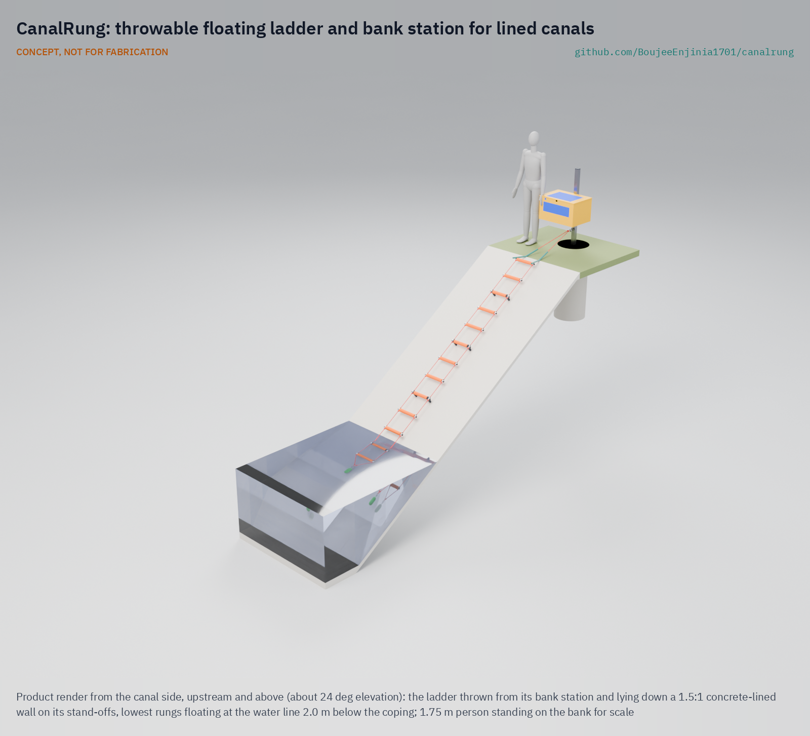
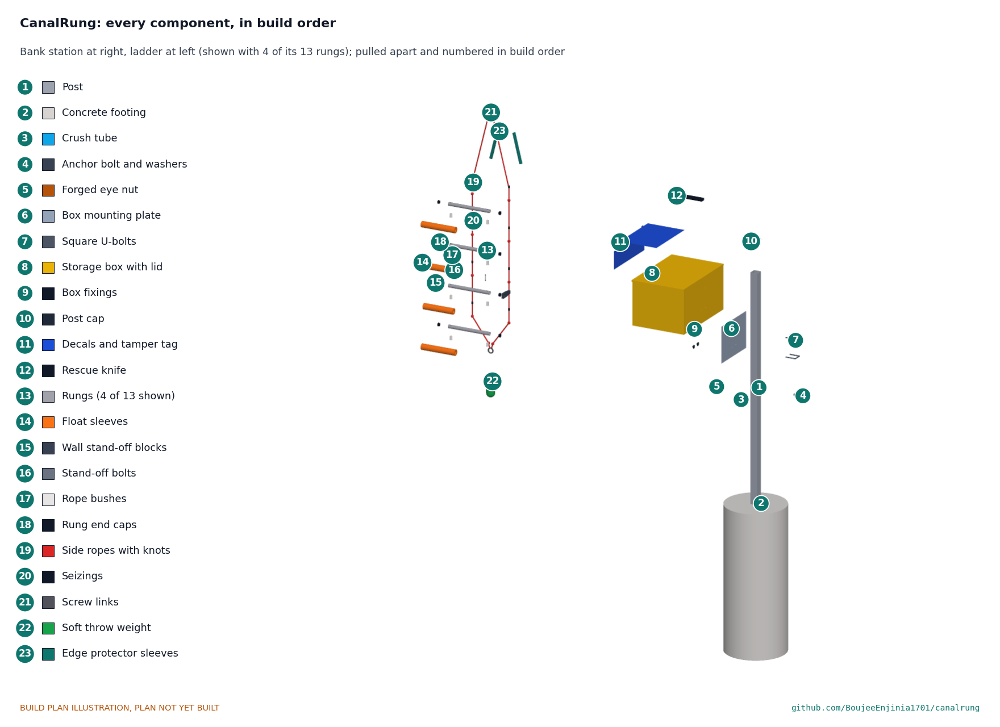

# CanalRung

   

**Area:** Situational field hardware · **TRL:** 3 of 9 (proof of concept on paper; constructable design) · **Value-engineering target:** USD 500; estimated cost USD 605.20 (USD 105.20 over the target) · **Difficulty:** 2 of 5

CONCEPT, NOT FOR FABRICATION. A research prototype design published as an open engineering reference, not certified life-saving equipment.

Gives someone in a steep canal a throwable floating ladder to climb out.

## Concept rationale

Most canal drownings are not about swimming. The water moves fast, the lined sides are steep and slick, and a person who falls in has nothing to hold. A ladder they can grab turns a steep wall into a way out. CanalRung is a ladder that a bystander can throw: rungs on rope, a weighted throw end so it drops down the wall, and a top that anchors on the bank. The person in the water grabs a rung and climbs out while the bystander stays on land.

Fixed escape ladders exist, but they are placed at intervals along the canal and may not be near the person in the water. A throwable ladder kept at farms, pump houses, schools and crossings brings the escape route to wherever someone falls in. Keeping it open and cheap, with a value-engineering target of USD 500 for a whole station, lets irrigation districts, farm groups and village committees build and place many.

## Burning platform

Drowning killed about 300,000 people in 2021, and 9 in 10 of those deaths happened in low and middle income countries ([WHO, 2024](https://www.who.int/news/item/13-12-2024-drowning-deaths-decline-globally-but-the-most-vulnerable-remain-at-risk)). Canals carry their share. The US Bureau of Reclamation counted 152 public drownings in its canals over 1964 to 1968, 40 per cent of them children under 11, and found hard-surface lined canals the most hazardous because of the difficulty in escaping from them ([USBR REC-ERC-71-36](https://www.usbr.gov/tsc/techreferences/hydraulics_lab/pubs/REC/REC-ERC-71-36.pdf)).

The pattern holds today. In Grant County, Washington, canals typically claim 1 to 4 lives a year, and the sheriff's office warns that once someone falls in, self-rescue is usually impossible because of steep concrete banks coated with dust or algae ([Columbia Basin Herald, 2026](https://columbiabasinherald.com/news/2026/jun/03/placid-in-appearance-canals-can-be-a-deathtrap/)). In Punjab, India, private divers estimate more than 100 deaths a year in the Bhakra canal alone ([The Tribune](https://www.tribuneindia.com/news/punjab/amid-no-govt-support-private-divers-recover-bodies-from-bhakhra-canal/)). Would-be rescuers are at risk too: Washington State's FACE programme describes two orchard workers who drowned in a concrete canal when one fell in and the other tried to rescue him ([Washington L&I FACE, 2002](https://stacks.cdc.gov/view/cdc/228712/cdc_228712_DS1.pdf)).

## Where it could be used

### By industry

| Industry | Use |
| --- | --- |
| Irrigation districts and water utilities | Throwable ladders at pump houses, checks, crossings and maintenance roads |
| Agriculture | Kit at farms and orchards beside canals, for workers and families |
| Schools and community groups | Stations at canal-side paths and crossings used by children |
| Fire and rescue services | Low-cost reach and climb aid carried on first-response vehicles |
| Inland waterways and ports | Throwable climb-out aid for quays and locks without fixed ladders |

### By country or region

| Country or region | Why it matters there |
| --- | --- |
| United States, western irrigation states | Grant County, Washington, sees 1 to 4 canal deaths a year and officials say self-rescue from its concrete-lined canals is usually impossible ([Columbia Basin Herald, 2026](https://columbiabasinherald.com/news/2026/jun/03/placid-in-appearance-canals-can-be-a-deathtrap/)). |
| United States, All-American Canal (California) | More than 600 people have drowned in the canal since 1942, and its eastern side is a steep concrete layer that is nearly impossible to climb out of ([KPBS, 2022](https://www.kpbs.org/news/local/2022/02/08/officials-doing-little-as-more-migrants-drown-in-imperial-county-canal)). |
| India, Punjab | Divers recovered 167 bodies from the Bhakra canal around Patiala between January 2021 and August 2022 ([The Tribune](https://www.tribuneindia.com/news/punjab/amid-no-govt-support-private-divers-recover-bodies-from-bhakhra-canal/)). |
| Pakistan, Punjab | In August 2026, 15 people drowned when a loaded rickshaw fell into the Muzaffargarh canal near Kot Adu; 11 were rescued alive ([The Nation, 2026](https://www.nation.com.pk/18-Aug-2026/three-children-s-bodies-recovered-eight-days-muzaffargarh-canal-tragedy)). |
| Low and middle income countries | Nine in ten drowning deaths happen in low and middle income countries, and the WHO African Region has the highest drowning rate ([WHO, 2024](https://www.who.int/news/item/13-12-2024-drowning-deaths-decline-globally-but-the-most-vulnerable-remain-at-risk)). |

## What sparked the idea

On 11 June 2026 in Hialeah, Florida, a 68-year-old man slipped into a canal. His friend went into the water to pull him out but could not bring him to the edge, and the current carried him to the centre of the canal, where he drowned ([WSVN, 2026](https://wsvn.com/news/local/miami-dade/2-men-drown-in-hialeah-canal-after-1-falls-in-friend-tries-to-rescue-him/)). The friend did what most people do: go in. CanalRung starts from the idea that the bystander should be able to send a way out down the bank instead.

## Problem

People who fall into lined irrigation canals often cannot climb the steep, slick sides, and bystanders who go in after them often drown too. There is rarely anything at the bank that lets the person in the water climb out on their own.

Full problem statement: [docs/01-problem.md](docs/01-problem.md)

## Concept

A bank station (a galvanised post in a concrete footing, with a forged eye nut near its foot and a bright storage box) holds a rope ladder whose top is already linked to the eye nut. A bystander lifts the lid and throws the soft-weighted bottom end upstream; 13 floating aluminium rungs on two low-stretch ropes lie down the lined wall on stand-offs, and the person in the water grabs a rung and climbs out while the bystander stays on land.

Key numbers on paper (CNR-CAL-001): a 4.02 m rung section reaches the water 2.1 m down a 1.5:1 wall or 3.8 m down a vertical wall; every rung floats with 0.22 to 0.28 kg to spare; a rung under 1.5 kN reaches 0.56 of yield and the two 9 mm ropes hold 18.4 kN wet with their knots; the anchor, on a 500 x 1,200 mm footing at every site, holds 4.5 kN in drained or saturated soil. The ladder as thrown weighs 4.27 kg, inside its 4.5 kg target.

Design precis: [docs/02-concept.md](docs/02-concept.md) · Requirements: [docs/03-requirements.md](docs/03-requirements.md) · Calculations: [docs/04-calcs/01-sizing.md](docs/04-calcs/01-sizing.md) · Prototype build plan: [docs/05-build-plan.md](docs/05-build-plan.md) · Design decisions: [docs/06-design-decisions.md](docs/06-design-decisions.md) · General arrangement: [CNR-DWG-001](cad/drawings/CNR-DWG-001.pdf) · 3D viewer: [media/viewer.html](media/viewer.html)

## Key components

- Post, concrete footing, crush tube, M16 anchor bolt and forged eye nut
- Mounting plate, square U-bolts and a 70 L storage box with decals, tamper tag and rescue knife
- 13 aluminium rungs with foam float sleeves, nylon rope bushes and end caps
- HDPE wall stand-off blocks on rungs 3, 6, 9 and 12
- Two 9 mm EN 1891 type B kernmantle side ropes, a stopper knot under every rung end and a seizing over it
- Screw links, a soft 0.5 kg throw weight and edge protector sleeves

## Building the prototype

The prototype build plan ([docs/05-build-plan.md](docs/05-build-plan.md)) shows how to make each of the 23 components and put them together in 16 steps, with a making sketch for every made part and a picture for every joint and step. The station is cut and drilled steel and aluminium, a small concrete footing and a bought box; the ladder is cut and drilled aluminium tube, foam and plastic, threaded on two ropes with a knot under each rung end. It is a plan, not yet built: building and proof-loading it is TRL 4 work, and its safety stops come first.

## Safety

> Never enter the water to rescue someone. Throw, anchor and call the emergency number.
>
> Rope in moving water can trap a person; a blunt-tip rescue knife is kept in the box lid.
>
> No one climbs or tests the ladder until it has been proof-loaded (CNR-BLD-001, section 6).
>
> Safety-critical rescue and rope equipment. Published as an open engineering reference, never as certified life-saving equipment.
>
> The anchor must hold the full climbing load; a bystander holding the top by hand can be pulled in.
>
> It is not a flotation device or life jacket.
>
> Inspect ropes and rungs for UV and abrasion damage on a set schedule, and replace on any doubt.
>
> This design is published as an open engineering reference. It is not certified equipment.

## Repository layout

| Folder | Contents |
| --- | --- |
| `docs/` | Problem, concept, requirements, calculations and design decisions |
| `cad/src/` | build123d Python source, the source of truth for all geometry |
| `cad/step/`, `cad/stl/` | Exported models for FreeCAD, other CAD tools and printing |
| `cad/drawings/` | 2D sketches and dimensioned drawings |
| `bom/` | Bill of materials |
| `electronics/` | KiCad schematics and PCB layouts |
| `firmware/` | Microcontroller code |
| `media/` | Renders, perspectives and photos |
| `build-log/` | Dated prototyping notes |

## Documentation

Controlled documents follow the portfolio [documentation standard](.kit/STANDARDS.md). Each carries a document ID (CNR-PRC-001 for the precis), a version and a revision history. Branded PDFs are built with `python .kit/render.py` and attached to GitHub Releases when a document is tagged, for example `CNR-PRC-001/v1.0`.

## Credits

Designed by Amish Chadha at Design Molecule Labs. See [CONTRIBUTORS.md](CONTRIBUTORS.md) for roles. To cite this design, use [CITATION.cff](CITATION.cff) (GitHub shows it as "Cite this repository").

AI assistance (Claude) was used to accelerate prototype documentation and first-pass research. Design direction and all decisions are Amish Chadha's, recorded in this repository's decision records (`docs/decisions/`).

## Licenses

- **Hardware** (CAD, drawings, BOM, electronics): [CERN-OHL-S v2](LICENSE)
- **Software** (firmware, scripts, notebooks): [MIT](LICENSE-SOFTWARE)

A project of the [Design Molecule](https://designmolecule.com) lab.
