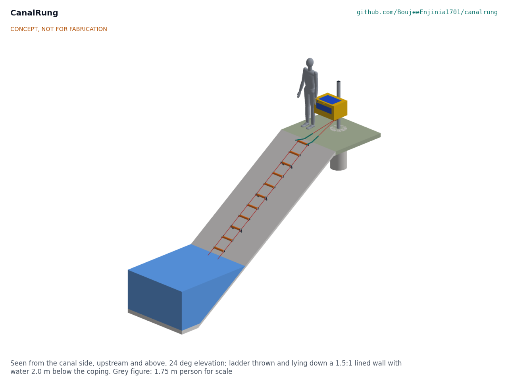
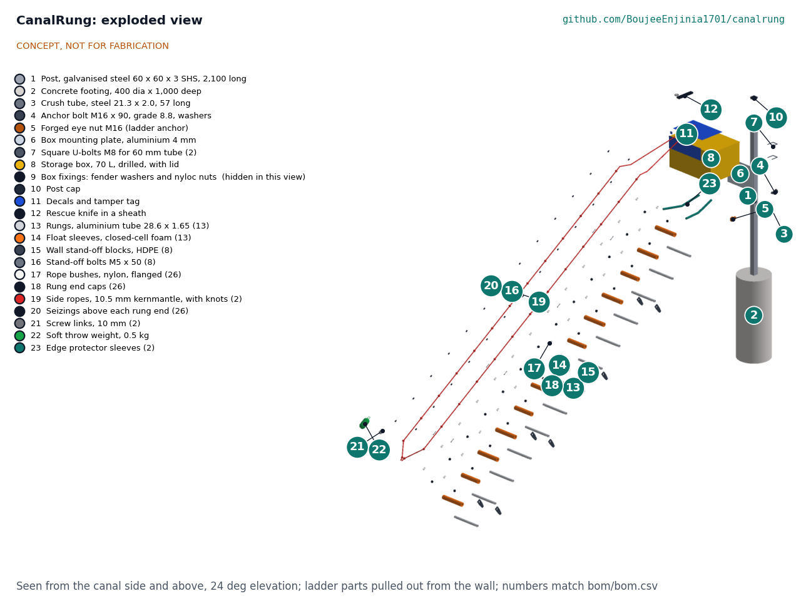

# CanalRung design precis

Gives someone in a steep canal a throwable floating ladder to climb out.

## Summary

CanalRung is a bank station and a rope ladder. The station is a galvanised post set in a concrete footing beside the canal, with a forged eye nut near its foot and a bright storage box on it. The ladder lives in the box with its top already linked to the eye nut. A bystander lifts the lid, throws the soft-weighted bottom end upstream of the person in the water and lets the ladder pay out down the lined wall. Thirteen floating aluminium rungs on two low-stretch ropes lie down the wall on stand-offs, so the person can get a hand behind a rung and climb out while the bystander stays on land. On paper the design reaches the water on the design walls, every rung floats, the rungs and ropes carry a heavy climber with margin and the anchor holds 4.5 kN in drained soil. The ladder as thrown weighs 4.48 kg, over its 4.0 kg target, and the parts cost about USD 544 against a USD 500 value-engineering target.

> **Safety:** Never enter the water to rescue someone. Throw, anchor and call the emergency number. CanalRung is safety-critical rescue and rope equipment, published as an open engineering reference and never as certified life-saving equipment. It is not a flotation device or life jacket. Rope in moving water can trap a person; a blunt-tip rescue knife is kept in the box lid. The anchor must hold the full climbing load: never hold the top of the ladder by hand.

## How it works

1. **Stored ready.** The ladder sits folded in a 70 L box on the station post, rungs in three stacks with the throw weight on top. The top of the ladder is already clipped to the eye nut at the foot of the post by a screw link, and the two ropes run under the box and up into it through a notch in the front rim, so the lid closes on them.
2. **Thrown.** The bystander lifts the lid (no lock; a numbered tamper tag shows it has been used), takes the throw weight and the top of the folded ladder, and throws upstream of the person. The soft 0.5 kg weight carries the bottom end down the wall and into the water.
3. **Lying down the wall.** The ropes lift out of the notch and run from the eye nut straight to the canal edge, over the coping in two hook-and-loop edge protector sleeves, and down the wall. Rungs 3, 6, 9 and 12 carry HDPE stand-off blocks that hold the ladder 95 mm off the concrete, so there is 70 mm of hand room behind each float sleeve.
4. **Floating at the water line.** Each rung has a closed-cell foam float sleeve. The rungs that reach the water float, so the lowest rungs sit at the surface where a person can grab them, while the weight hangs 280 mm below the bottom rung and keeps that end from skating away on the current.
5. **Climbing out.** The person grabs a rung and climbs. Each rung rests on an overhand stopper knot under each end, so the climbing load goes from the rung into the knots, up the ropes, through the top link and eye nut into the post and its footing.

## Main components

*Table 1. Components, in build order; the numbers are the lines of `bom/bom.csv`.*

| # | Component | Role |
| --- | --- | --- |
| 1 | Post, galvanised 60 x 60 x 3 SHS, 2,100 long | Holds the box at a reachable height and carries the ladder anchor |
| 2 | Concrete footing, 400 dia x 1,000 deep | Holds the post against the anchor load |
| 3 | Crush tube, 21.3 x 2.0, 57 long | Lets the anchor bolt be tightened without crushing the post |
| 4, 5 | M16 grade 8.8 anchor bolt and forged M16 eye nut | The ladder anchor, 250 mm above ground, loaded in line with its thread |
| 6, 7, 9 | Mounting plate, two square U-bolts, washers and nyloc nuts | Clamp the box to the post with no holes in the post |
| 8 | Storage box, 70 L, UV-stabilised, hinged lid, no lock | Keeps the ladder dry, dark and ready; drains through four holes |
| 10 to 12 | Post cap, decals and tamper tag, rescue knife | Weather, instructions ("do not enter the water"), use indicator, entanglement cutter |
| 13 | Rungs, 6061-T6 tube 28.6 x 1.65 x 360 (13) | Hand and foot holds at 335 mm pitch, 298 mm clear width |
| 14 | Float sleeves, closed-cell foam 50 OD (13) | Buoyancy and grip; high-visibility orange |
| 15, 16 | Stand-off blocks, HDPE (8), and M5 bolts | Hold the ladder 95 mm off the wall at rungs 3, 6, 9 and 12 |
| 17, 18 | Nylon rope bushes (26) and end caps (26) | Keep the rope off the aluminium hole edges; close the tube ends |
| 19, 20 | Side ropes, 10.5 mm EN 1891 type A (2 x 8.0 m), knots and seizings | Carry the climbing load; a knot under and a seizing over each rung end |
| 21 | Screw links, 10 mm (2) | Top: ropes to the eye nut; bottom: ropes to the throw weight |
| 22 | Soft throw weight, 0.5 kg steel shot pouch | Carries the bottom end down and into the water; cannot injure |
| 23 | Edge protector sleeves (2) | Keep the ropes off the concrete edge of the coping |

*Figure 1. Concept render from the constructable model, seen from the canal side.*

*Figure 2. Exploded view; numbers match the bill of materials.*

## Numbers from the TRL 3 calculations

All figures are from CNR-CAL-001 (`docs/04-calcs/sizing.py`), with the assumptions stated there.

*Table 2. Key figures.*

| Quantity | Value | Basis |
| --- | --- | --- |
| Rung section | 4,020 mm, 13 rungs at 335 mm | [A1] |
| Reach | Two rungs in the water on a 1.5:1 slope with water 2.0 m down; works to 2.1 m on that slope and to 3.8 m on a vertical wall | [A3] to [A5] |
| Hand room and width | 70 mm behind the float sleeve at a stand-off; 298 mm clear between bushes | [A6] |
| Ladder as thrown | 4.48 kg (target 4.0 kg) | [B3] |
| Spare buoyancy | 0.27 kg per plain rung, 0.22 kg per stand-off rung; bottom three rungs carry the throw weight 1.73 times over | [C1], [C2] |
| Rung stress at 1.5 kN | 135 MPa, 0.56 of the 240 MPa minimum yield | [D1] |
| Rope strength | 22.4 kN for both ropes, wet, with stopper knots; 5.0 times the 4.5 kN target | [E1] |
| Anchor load in use | 1.47 kN for a 100 kg climber with a 1.5 dynamic factor; 2.32 kN upper bound with full current drag | [F1] to [F4] |
| Anchor elements | Eye nut 1.53 times the target; post at 0.39 of yield; footing 1.92 times in drained soil, 0.85 in saturated soil (larger footing 1.59) | [G1] to [G5] |
| Deploy time | About 15 s (estimate) | [H1] |
| Cost | Value-engineering target: USD 500. Estimated cost of the constructable design: USD 543.60 (USD 43.60 over the target) | [I1] |

## Key design choices

Every choice below was decided on 2026-10-03 under Amish's pre-approval of the batch ("I pre-approve the batch runs along with any recommendations you come up with"); the full reasoning is in CNR-DDR-001 and CNR-DDR-002.

1. **A fixed station is the anchor.** The scaffold listed a ground stake, a post loop or a cross bar. A bystander cannot drive a stake that holds 4.5 kN in 30 s, so the post itself, set in concrete, carries the anchor, and the ladder top is linked to it before any emergency. A portable anchor is left for a later vehicle kit.
2. **Strong rungs over light rungs.** 28.6 x 1.65 mm 6061-T6 tube keeps the rung at 0.56 of yield; the lighter 25.4 mm tube would save 0.20 kg but reach 0.73. Safety first; R2 is reported as not met.
3. **Knots carry the rungs.** Each rope runs through a nylon bush in each rung end; an overhand stopper knot under the bush carries the load and a twine seizing over it stops the rung floating up. This is the classic rope ladder joint, needs no special tools and can be inspected by eye. EN 1891 type A rope is tested with knotted terminations (at least 15 kN with figure-eight knots), so its knotted strength is known.
4. **Weighted and floating.** The soft weight sinks and the rungs float, which answers the scaffold's open question: the bottom end goes down and stays put while the lowest rungs sit at the surface.
5. **Stand-offs on every third rung.** Four stand-off rungs keep the taut ladder off the wall along its length at a cost of 0.42 kg; more would add mass, fewer would let it lie on the concrete between them.
6. **No throw line in the first prototype.** A second line adds tangling and an entanglement hazard for the person in the water; it can be tried after the throw trials.
7. **No lock on the box.** A tamper tag, signage and inspection instead.

## Patent design-arounds

From the preliminary patent, trademark and prior-art screen (not legal advice):

- No elastic self-stowing mechanism, to stay clear of the patented Rapid Rung swim ladder. The constructable design keeps to this: the ladder folds by hand into a box.
- Find and read the Rapid Rung patent number before public release (an action in the design decisions register, CNR-DEC-001).
- Build on expired buoyant ladder prior art such as US3411166A and US4989691A, and on the long-standing rope ladder construction (rungs on knots), which is public domain.

## Shared blocks

- CalRig proof-load rig, for the rope, rung and anchor proof loads at TRL 4 (a candidate shared block, not yet agreed).
- A boarding step for the LaneSkiff flood rescue skiff was proposed at TRL 1; it is outside this repository's scope and is recorded as a possible later use of the rung and rope joint only (CNR-DDR-001, D12).

## Safety

> **Safety:** CanalRung is safety-critical rescue and rope equipment, published as an open engineering reference and never as certified life-saving equipment. Never enter the water to rescue someone: throw, anchor and call the emergency number. The anchor must hold the full climbing load; a bystander holding the top by hand can be pulled in, which is why the top is linked to the post before any emergency. The ladder is not a flotation device or life jacket. Rope in moving water can trap a person or a limb: keep the knife in the lid and cut, do not pull, if anyone is caught. Inspect ropes, knots, seizings, bushes and the eye nut on a set schedule and after every use, and replace on any doubt. The footing must suit the soil at the site; on wet or soft banks use the larger footing. Building and testing the prototype is TRL 4 work with its own safety stops (CNR-BLD-001, section 6).

## Open decisions

None. All decisions were made under Amish's 2026-10-03 pre-approval; see the design decisions register CNR-DEC-001 (`docs/06-design-decisions.md`), which also lists the facts to confirm when parts are bought.
