# CanalRung prototype build plan

**Plan, not yet built.** How to build the first proof-of-concept prototype, component by component. Building and testing to it is TRL 4 work. Decisions still to be made are kept in the design decisions register ([docs/06-design-decisions.md](06-design-decisions.md)), not here.

## 1. What you are building

*Figure 1. Every component pulled apart and numbered in build order. The ladder is drawn with 4 of its 13 rungs so the parts stay readable.*

The prototype is one CanalRung station and its ladder. The station is a galvanised steel post set in a concrete footing a metre back from the canal edge, with a forged eye nut near its foot that anchors the ladder and a bright plastic box clamped to it that holds the ladder. The ladder is 13 aluminium tube rungs, each in an orange foam float sleeve, hung on two red climbing-grade ropes by a knot under each rung end, with plastic stand-off blocks on four rungs, a soft weight at the bottom and a screw link at each end. Figure 1 shows the 23 components in the order you make or fit them. Nine are made in a small workshop or on site: the post, the footing, the crush tube, the mounting plate, the drilled box, the rungs, the float sleeves, the stand-off blocks and the ropes. The rest are bought and fitted. The work is cutting and drilling steel and aluminium tube, cutting aluminium sheet, plastic and foam, digging and pouring a small footing, and rope work: cutting, sealing, tying knots and seizing. The parts cost about USD 605, from the bill of materials.

> **Safety:** CanalRung is rescue and rope equipment that a person's life will depend on. Build it carefully, inspect every knot, and never let anyone climb it, stand on it or test it in water until section 6 says so. Work at the canal edge only with a second person watching and a life jacket on; dig only after underground services have been located. Cut tube and sheet edges are sharp: deburr everything and wear gloves. Heat sealing rope ends gives off fumes; do it in a ventilated space.

## 2. What changed to make it buildable

The concept showed what CanalRung does; some of its parts could not be made or fixed as drawn. Each change below keeps what the ladder does, and all are recorded in decision record CNR-DDR-002.

*Table 1. Changes from the concept.*

| Component | The concept had | The buildable design has | Why |
| --- | --- | --- | --- |
| Rung to rope | Rungs "fixed at even spacing", no joint | The rope runs through a bushed hole in each rung end; a knot under the rung carries it and a seizing over it stops it floating up (Figure 11) | The classic rope ladder joint, made with hand tools and checked by eye |
| Wall spacers | Spacers on some rungs, no fixing | Plastic blocks on rungs 3, 6, 9 and 12, each locked by one M5 bolt through block and rung (Figure 15) | They cannot slide or turn |
| Floats | "Buoyant rungs" | A closed-cell foam sleeve on every rung, cut to fit between the bushes or blocks (Figure 13) | Known buoyancy; the sleeve length is set by the parts beside it |
| Tube ends | Open | Plastic end caps that stop short of the rope hole | No sharp or open ends |
| Anchor | Stake, post loop or cross bar | Forged eye nut on a bolt through the post, with a crush tube inside (Figure 6) | A fixed anchor that holds 4.5 kN; the post walls do not crush |
| Box | On the post, no fixing | An aluminium plate and two U-bolts round the post; the U-bolt legs pass through the box back (Figure 9) | No holes in the post for the box |
| Rope ends | No termination | A loop at each end, held in rated screw links at the eye nut and at the throw weight (Figures 17 and 18) | Rated, replaceable connections |
| Canal edge | Ropes on the concrete edge | Two sleeves on the ropes where they cross the edge (Figure 19) | Rope over a sharp edge loses strength |
| Box lid | Could not close over the anchored ropes | A notch in the front rim and four drain holes (Figure 8) | The ladder stays linked to the anchor while stored |
| Footing | No size | 500 mm across and 1,200 mm deep at every site, wet or dry (Figure 4) | Holds the anchor load in wet or dry bank soil, so one size fits every site |

## 3. Making the components

Make and check each component before the assembly step that needs it. Sizes are in millimetres. On the station, "canal side" is the face of the post toward the water and "back" the face away from it. On the ladder, "up" is toward rung 1, the top rung, and "wall side" is the side the stand-off blocks point to. Workshop tolerance is 1 mm unless a step says otherwise; drawings do not carry tolerances before TRL 4.

### 3.1 Post

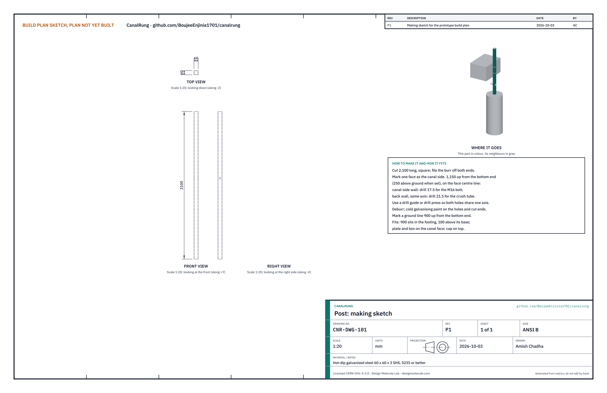

*Figure 2. Post making sketch (CNR-DWG-101).*

**What it is and what it is made from.** The upright that holds the box and carries the ladder anchor. Hot-dip galvanised square steel tube 60 x 60 x 3 mm, grade S235 or better, 2,300 long.

**How to make it.**

1. Cut the tube to 2,300, square, and file the burr off both ends.
2. Choose one face as the canal side and mark it along its length.
3. Measure 1,350 up from the bottom end and mark the centre of the canal-side face and of the back face at that height. This puts the anchor 250 above the ground.
4. Clamp the post in a drill press or use a drill guide so both holes share one axis square to the faces. Drill a 6 pilot right through both walls.
5. Open the hole in the canal-side wall to 17.5 (for the bolt) and the hole in the back wall to 21.5 (for the crush tube).
6. Deburr both holes inside and out. Paint the holes and both cut ends with cold galvanising paint.
7. Mark a ground line all round, 1,100 up from the bottom end.

**How it fits the parts next to it.** The bottom 1,100 sits in the concrete footing with 100 of concrete under it (Figure 4). The crush tube goes in through the back hole and the anchor bolt through both (Figure 6). The mounting plate sits flat on the canal-side face with its bottom edge 480 above the ground line, held by two U-bolts round the back of the post (Figure 9). The cap closes the top.

**Check before moving on.** Push a 16 rod through both holes: it must pass straight through without forcing. The 21.3 crush tube must slide into the back hole.

### 3.2 Concrete footing

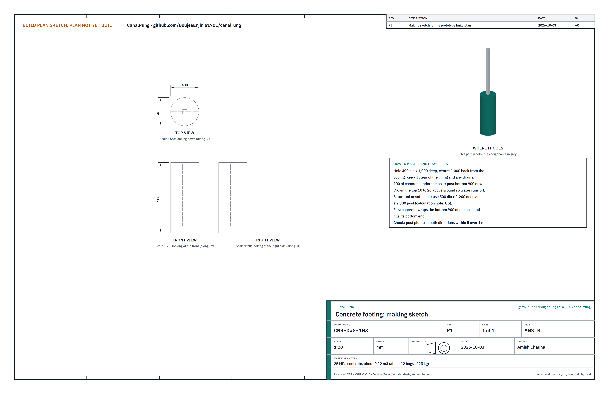

*Figure 3. Footing making sketch (CNR-DWG-103).*

**What it is and what it is made from.** The concrete that holds the post in the bank against the pull of a climber. About 0.23 m3 of 25 MPa concrete, about 22 bags of 25 kg premix, in a hole 500 across and 1,200 deep. This one size is used at every site, whether the bank is dry or wet.

**How to make it.**

1. Choose the spot with the canal operator: 1,000 from the canal edge to the post centre, on level bank, clear of the lining's joints, drains and any buried services (have them located first).
2. Dig or auger the hole 500 across and 1,200 deep, with straight sides. Keep the spoil away from the canal edge.
3. Pour 100 of concrete into the bottom and level it.
4. Stand the post on it (assembly step 1), plumb it both ways with a spirit level and brace it.
5. Fill the hole in layers of about 200, rodding each layer to drive out air, up to 10 to 20 above the ground, and slope the top away from the post so water runs off.
6. Keep the concrete damp and leave it 7 days before any load goes on the eye nut.

**How it fits the parts next to it.**

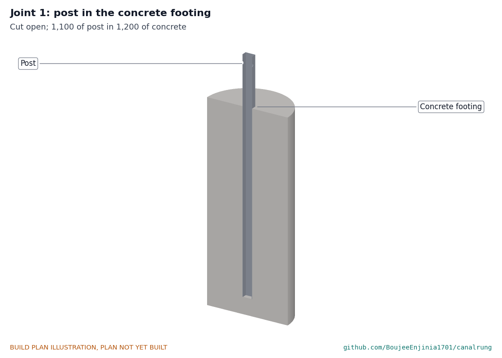

*Figure 4. The post stands on 100 of concrete; the concrete wraps its bottom 1,100 and fills its open end.*

**Check before moving on.** The post is plumb within 5 in 1,000 in both directions, the ground line is level with the ground, and the concrete is sound with no voids at the top.

### 3.3 Crush tube

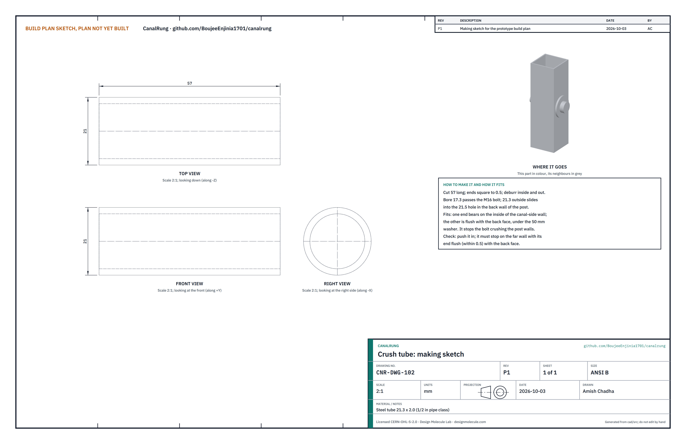

*Figure 5. Crush tube making sketch (CNR-DWG-102).*

**What it is and what it is made from.** A short steel tube inside the post that the anchor bolt passes through, so the bolt can be tightened without squashing the post. Steel tube 21.3 outside, 2.0 wall (half-inch pipe class).

**How to make it.**

1. Cut 57 long with the ends square within 0.5.
2. Deburr inside and out so the bolt slides through.

**How it fits the parts next to it.**

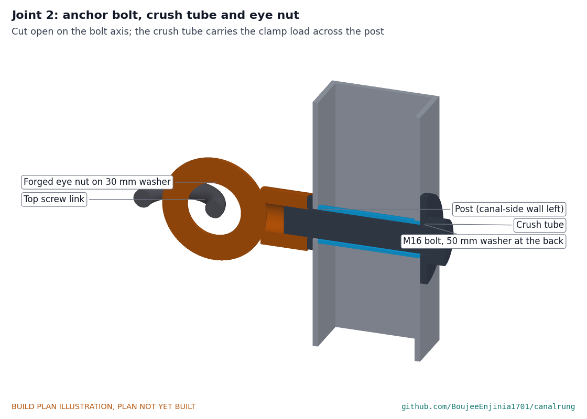

*Figure 6. The crush tube goes in through the back wall and stops on the inside of the canal-side wall; the bolt runs through it; the eye nut screws onto the bolt on the canal side; the top screw link passes through the eye.*

One end bears on the inside face of the canal-side wall; the other end is flush with the back face, where the 50 mm washer under the bolt head covers it. Tightening the bolt clamps the canal-side wall between the eye nut's washer and the crush tube, not the two walls together.

**Check before moving on.** Push the tube into the back hole: it must stop on the far wall with its end flush with the back face, within 0.5.

### 3.4 Box mounting plate

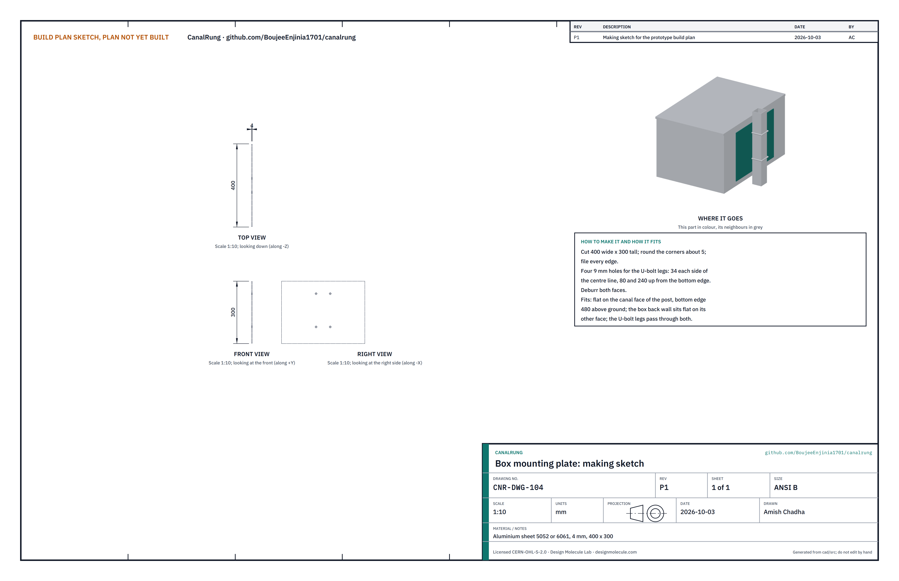

*Figure 7. Mounting plate making sketch (CNR-DWG-104).*

**What it is and what it is made from.** A flat plate between the post and the back of the box that spreads the clamp load over the plastic. Aluminium sheet 4 thick, 5052 or 6061 class, 400 wide and 300 tall.

**How to make it.**

1. Cut the plate to 400 x 300 and round the corners to about 5. File every edge smooth.
2. Mark a centre line down the 300 height.
3. Drill four 9 holes for the U-bolt legs: 34 each side of the centre line, at 80 and 240 up from the bottom edge.
4. Deburr both faces.

**How it fits the parts next to it.** The plate sits flat on the canal-side face of the post, centred on it, with its bottom edge 480 above the ground. The box's back wall sits flat on its other face. The U-bolt legs pass through the plate and then the box (Figure 9).

**Check before moving on.** Hold the plate on the post at the right height: the holes must sit just outside the post's sides, 4 clear of them, where the U-bolt legs will run.

### 3.5 Storage box, drilled

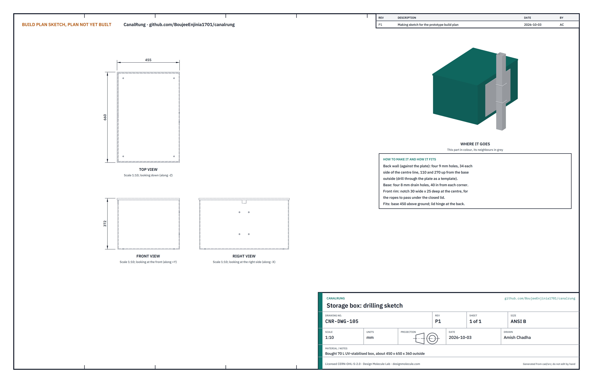

*Figure 8. Storage box drilling sketch (CNR-DWG-105).*

**What it is and what it is made from.** A bought polypropylene or polyethylene storage box of about 70 L, about 450 deep, 650 wide and 360 tall outside, UV-stabilised, bright yellow or orange, with a hinged lid, clip latches and no lock. Check before buying that its inside depth takes a 370 long rung.

**How to make it.**

1. Hold the drilled mounting plate against the outside of the box's back wall, its bottom edge 30 above the box's base, centred. Mark the four holes through the plate. They come out 34 each side of the centre line and 110 and 270 up from the base.
2. Drill the four holes 9, from outside, with a sharp drill and a wood block inside the box behind the wall so the plastic does not split.
3. Drill four 8 drain holes in the base, 40 in from each corner.
4. Cut a notch 30 wide and 25 deep in the centre of the front rim (the side away from the hinge), with a fine saw and a file. Round its corners so the rope slides out easily.
5. Deburr every hole and the notch with a knife.

**How it fits the parts next to it.** The back wall sits flat on the mounting plate, with the lid hinge at the back, against the post. The U-bolt legs come through the four holes into the box, where a fender washer and a nyloc nut on each hold the box, the plate and the post together.

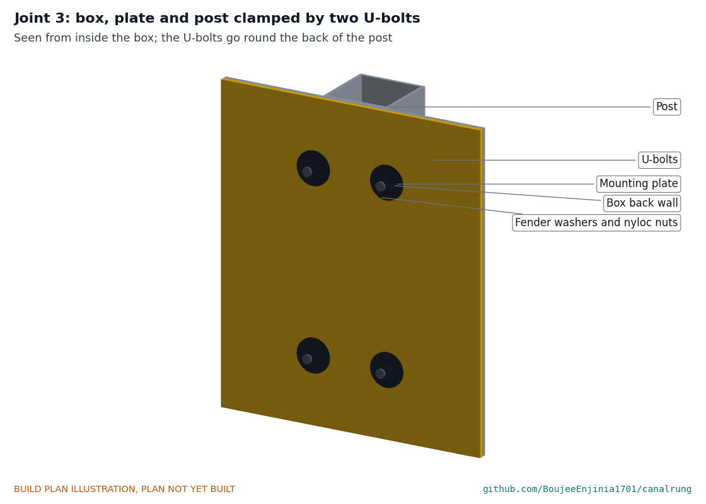

*Figure 9. Seen from inside the box: the U-bolts go round the back of the post, through the plate and the box back wall; washers and nyloc nuts inside.*

**Check before moving on.** The lid closes and latches with a 9 rope lying in the notch.

### 3.6 Rungs (make 13)

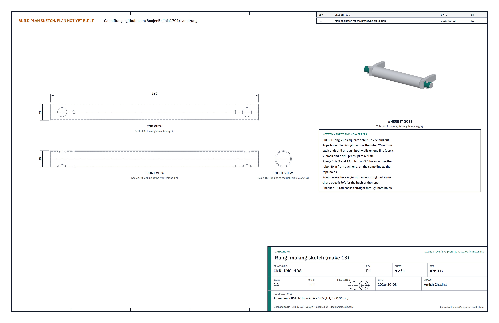

*Figure 10. Rung making sketch (CNR-DWG-106), shown as a stand-off rung with both pairs of holes.*

**What it is and what it is made from.** The hand and foot holds. Aluminium 6061-T6 round tube, 28.6 outside and 1.65 wall (1-1/8 in x 0.065 in), 360 long. About 4.7 m of tube for all 13.

**How to make it.**

1. Cut 13 lengths of 360, ends square, with a tube cutter or a fine saw and a square guide. Deburr inside and out.
2. Number the rungs 1 to 13 with a marker; rung 1 is the top rung. Rungs 3, 6, 9 and 12 are the stand-off rungs.
3. Lay each rung in a V-block on a drill press. Drill a 6 pilot right across the tube, 20 in from each end, through both walls on one line, then open the holes to 16. These are the rope holes.
4. Stand-off rungs only: on the same line as the rope holes, drill 5.3 right across the tube 40 in from each end (the block bolt holes).
5. Round the edge of every hole, inside and out, with a deburring tool, so no sharp edge is left for the bush.

**How it fits the parts next to it.**

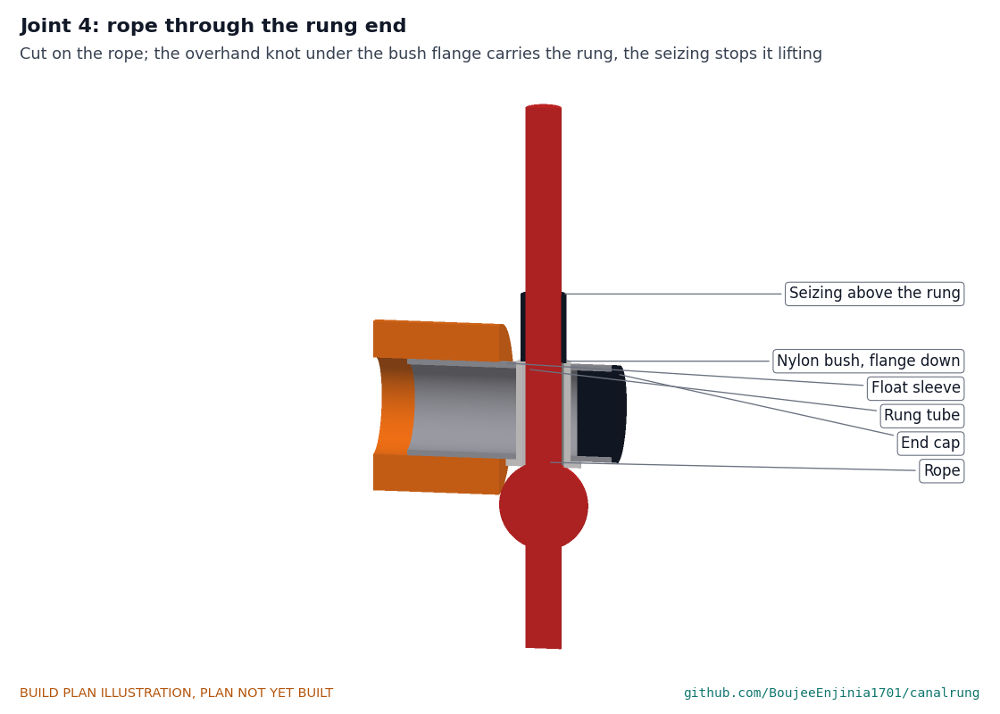

*Figure 11. The nylon bush lines the rope hole with its flange under the rung; the overhand knot under the flange carries the rung; the seizing above the bush stops it lifting; the end cap stops 2 short of the hole.*

A flanged nylon bush goes up through each rope hole from below, flange under the rung. The rope runs through the bush. The foam sleeve sits on the middle of the rung, 2 clear of the bushes. An end cap closes each end.

**Check before moving on.** A 16 rod passes straight through each pair of rope holes; all 13 rungs lie flat together with their holes lined up (sight along them).

### 3.7 Float sleeves (make 13)

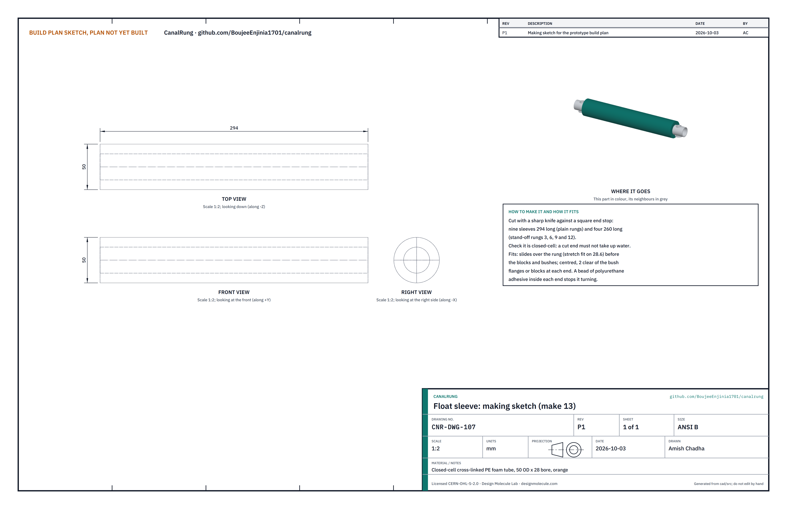

*Figure 12. Float sleeve making sketch (CNR-DWG-107).*

**What it is and what it is made from.** The orange foam sleeve on each rung that makes it float and gives a softer grip. Closed-cell cross-linked polyethylene foam tube, 50 outside, 28 bore, about 33 kg/m3. About 3.7 m of tube in all.

**How to make it.**

1. Cut a short test piece and hold it under water for a minute; a cut end that takes up water means the foam is not closed-cell, so do not use it.
2. With a sharp knife against a square end stop, cut nine sleeves 294 long (for the plain rungs) and four 260 long (for rungs 3, 6, 9 and 12).

**How it fits the parts next to it.**

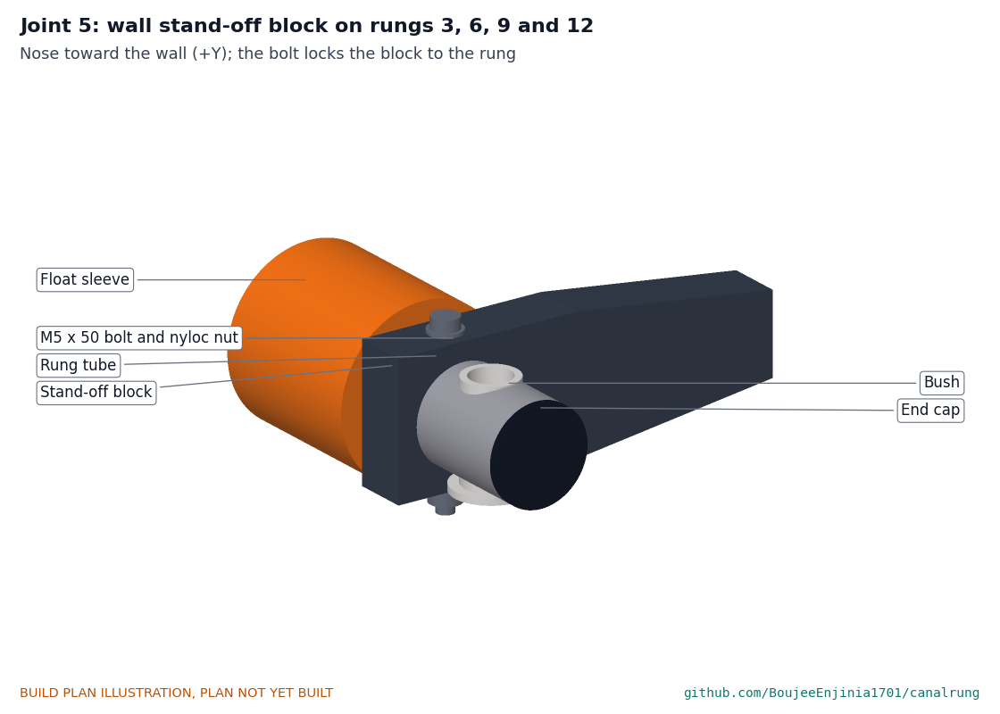

*Figure 13. On a stand-off rung the shorter sleeve sits between the blocks; on a plain rung the longer sleeve sits between the bushes.*

The sleeve slides over the rung before the blocks and bushes go on, and sits in the middle with about 2 clear at each end. A bead of polyurethane adhesive inside each end stops it turning on the rung.

**Check before moving on.** The sleeve grips the rung and does not slide under its own weight.

### 3.8 Wall stand-off blocks (make 8)

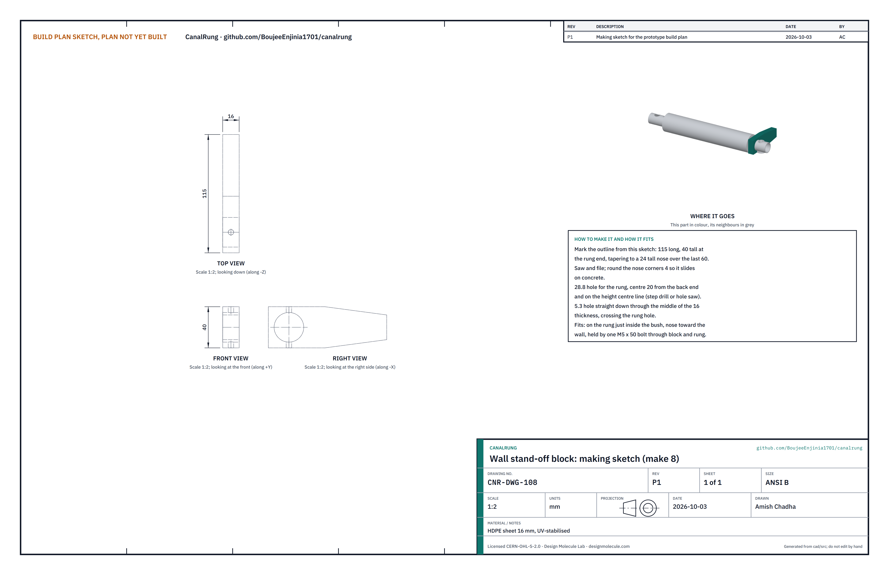

*Figure 14. Stand-off block making sketch (CNR-DWG-108).*

**What it is and what it is made from.** The plastic blocks on rungs 3, 6, 9 and 12 that hold the ladder off the wall so a hand can get behind each rung. HDPE sheet 16 thick, UV-stabilised; one 300 x 150 offcut makes all eight.

**How to make it.**

1. Mark the outline on the sheet eight times: 115 long; 40 tall for the first 55 from the back end; then tapering over the last 60 to a 24 tall nose.
2. Saw just outside the lines and file to them. Round the nose corners to about 4 so the block slides on concrete.
3. Drill a 28.8 hole for the rung, its centre 20 from the back end and on the height centre line (step drill or hole saw, slowly, with the sheet clamped).
4. Drill a 5.3 hole straight down through the middle of the 16 thickness, crossing the rung hole at its centre.
5. Deburr with a knife.

**How it fits the parts next to it.**

*Figure 15. The block on the rung, nose toward the wall, locked by an M5 bolt down through the block and the rung.*

Each block slides onto the rung from its end, after the foam sleeve, and sits just inside the bush with 1 to spare. Its nose points to the wall side. One M5 x 50 bolt goes down through the block and the rung's 5.3 holes, with a washer each side and a nyloc nut underneath. The nose is 95 from the rung's centre, so the foam sleeve stands 70 off the wall.

**Check before moving on.** On a stand-off rung, both blocks point the same way and lie flat on a table together.

### 3.9 Side ropes (make 2)

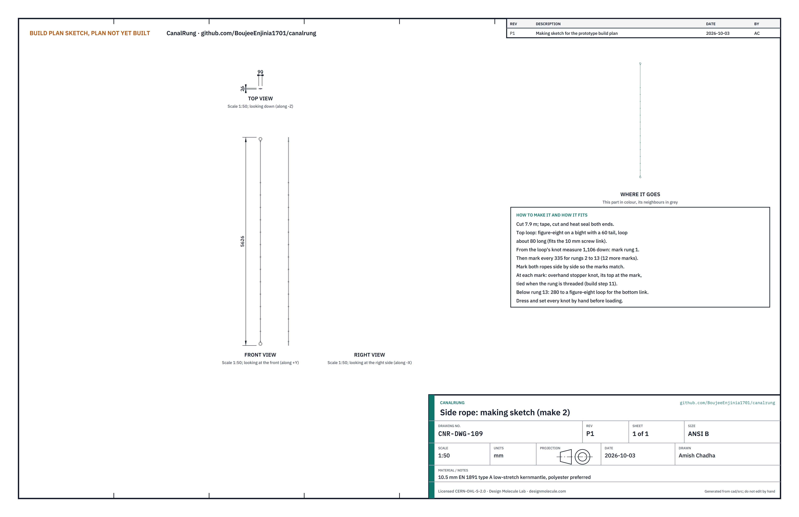

*Figure 16. Side rope making sketch (CNR-DWG-109): the rope finished, laid straight, with its loops and knots.*

**What it is and what it is made from.** The two ropes that carry the rungs and the climber. 9 low-stretch kernmantle rope to EN 1891 type B, with a declared breaking strength of at least 18 kN, polyester if available. 16 m in all. It runs freely through the 12 bore of the bushes, and its stopper knot is still far too big to pull through.

**How to make it.**

1. Cut two lengths of 8.0 m: wrap tape round the rope, cut through the tape with a hot knife, and seal each end.
2. Tie a figure-eight on a bight at one end of each rope, with a loop about 80 long and a tail of at least 60. Dress the knot so its strands lie side by side and pull it tight.
3. Lay both ropes side by side on a clean floor with the loops together. From the loop's knot measure 1,106 along each rope and mark rung 1. Then mark every 335 for rungs 2 to 13: twelve more marks. Use a fine marker or a wrap of tape; the marks must match on both ropes.
4. Leave the rest of each rope free; the stopper knots are tied as the rungs go on (assembly step 11).

**How it fits the parts next to it.** Each rope runs down through the bushes at one end of every rung. An overhand stopper knot sits under each bush flange at its mark and carries the rung (Figure 11); a seizing above the bush stops the rung lifting. The top loops go into one screw link on the eye nut (Figure 17); below rung 13 each rope runs 280 to a second figure-eight loop, and both loops and the weight's webbing loop go into the bottom screw link (Figure 18). Where the ropes cross the canal edge they run in sleeves (Figure 19).

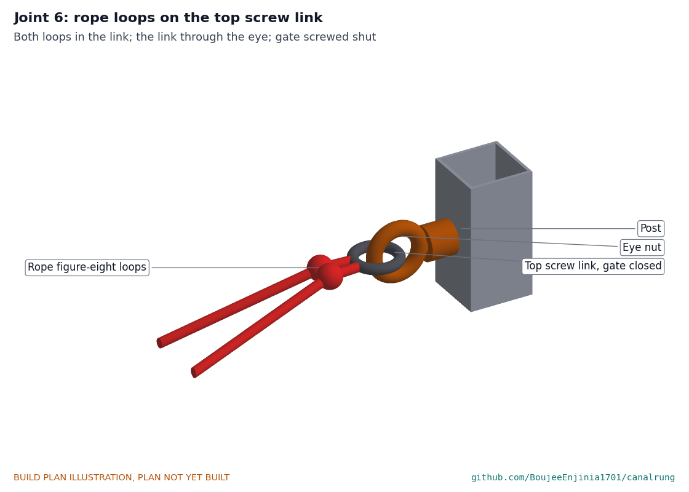

*Figure 17. Both top loops in one screw link; the link through the eye nut's ring; the gate screwed fully shut.*

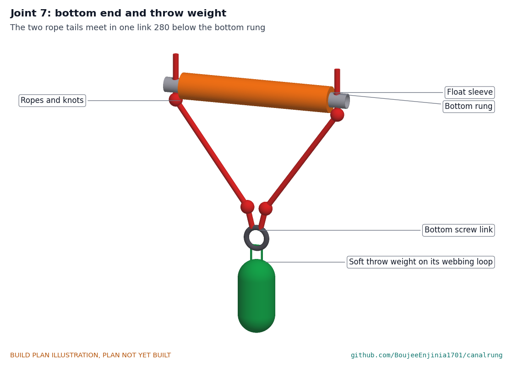

*Figure 18. The two rope tails meet in the bottom link 280 below the bottom rung; the soft weight hangs from it on its webbing loop.*

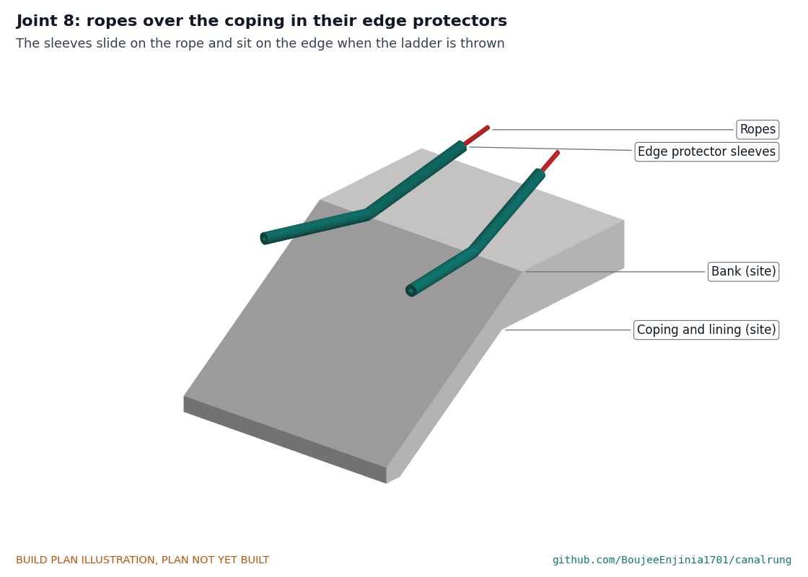

*Figure 19. The edge protector sleeves slide on the ropes and sit on the concrete edge when the ladder is thrown.*

**Check before moving on.** Both ropes are the same length to within 20 between the loop knot and the last mark; every mark is 335 from the next within 3.

### 3.10 Bought components

| Component | What to buy | What to do to it |
| --- | --- | --- |
| Anchor bolt set | M16 x 90 hex bolt, grade 8.8, galvanised; one 50 outside x 4 washer and one 30 outside x 3 washer; high-strength threadlocker | Nothing |
| Forged eye nut | M16 forged steel eye nut, DIN 582 class, marked with a working load limit of at least 700 kg | Check the marking; reject any unmarked or cast eye |
| Square U-bolts (2) | M8 square U-bolt for 60 square tube, 80 usable leg, with nuts | Nothing |
| Box fixings (4) | M8 nyloc nut and 30 outside fender washer, stainless | Nothing |
| Post cap | Plastic cap for 60 square tube | Nothing |
| Decals and tamper tag | UV-laminated vinyl: a pictogram how-to for the lid (open, throw upstream, never go in) and a front warning (do not enter the water, call the emergency number, not a seat); a numbered plastic tamper tag | Apply to clean, dry plastic |
| Rescue knife | Blunt-tip rope rescue knife with a sheath | Tether it under the lid with a cable tie through the sheath |
| Rope bushes (26) | Nylon flanged sleeve bush, 12 bore, 16 outside, 22 flange x 2, 30 long | Trim to 29 long with a knife so the top sits just proud of the rung |
| Rung end caps (26) | Plastic insert plug for 28.6 x 1.65 tube | Trim the insert to 10 long if longer, so it stops short of the rope hole |
| Stand-off bolts (8) | M5 x 50 stainless A2-70 bolt, two washers, one nyloc nut | Nothing |
| Seizing twine | Waxed polyester whipping twine, about 1 | Nothing |
| Screw links (2) | 10 steel screw link (maillon), marked with a working load limit of at least 1,000 kg, about 60 inside length | Check the marking and that the gate closes fully |
| Soft throw weight | 0.5 kg fabric pouch of lead-free steel shot with a sewn webbing loop, bright colour | Nothing |
| Edge protector sleeves (2) | PVC-coated polyester rope protector, hook-and-loop, 500 long, for 9 to 13 rope | Nothing |

## 4. Putting it together

The station (steps 1 to 7) and the ladder (steps 8 to 14) can be built at the same time; steps 15 and 16 join them. The ladder pictures show 4 of the 13 rungs. In the step pictures, parts already fitted are grey and the parts being fitted are in colour, with a red arrow showing the way they go in.

### Step 1: stand the post in the hole

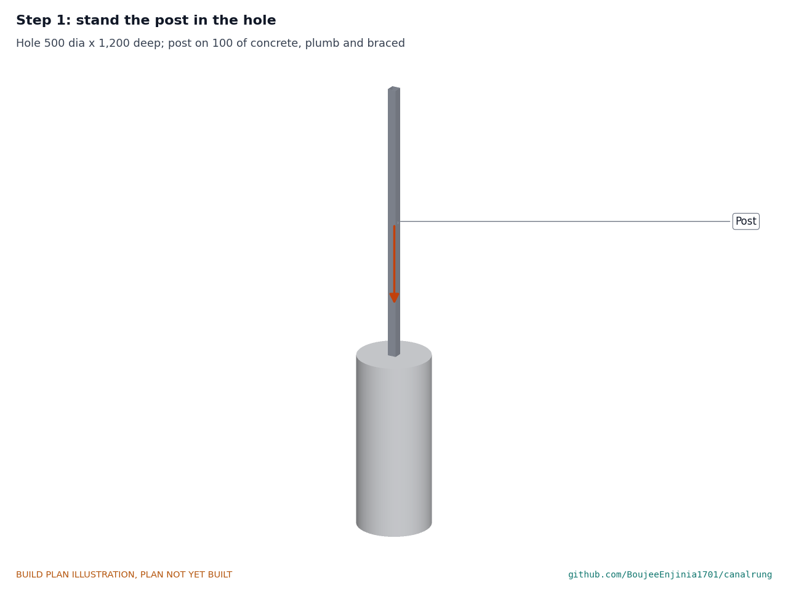

Pour the 100 of concrete into the base of the hole and level it. Stand the post on it with the canal-side face toward the canal and the ground line level with the ground. Plumb it both ways and brace it with two timber battens and clamps.

### Step 2: pour the footing

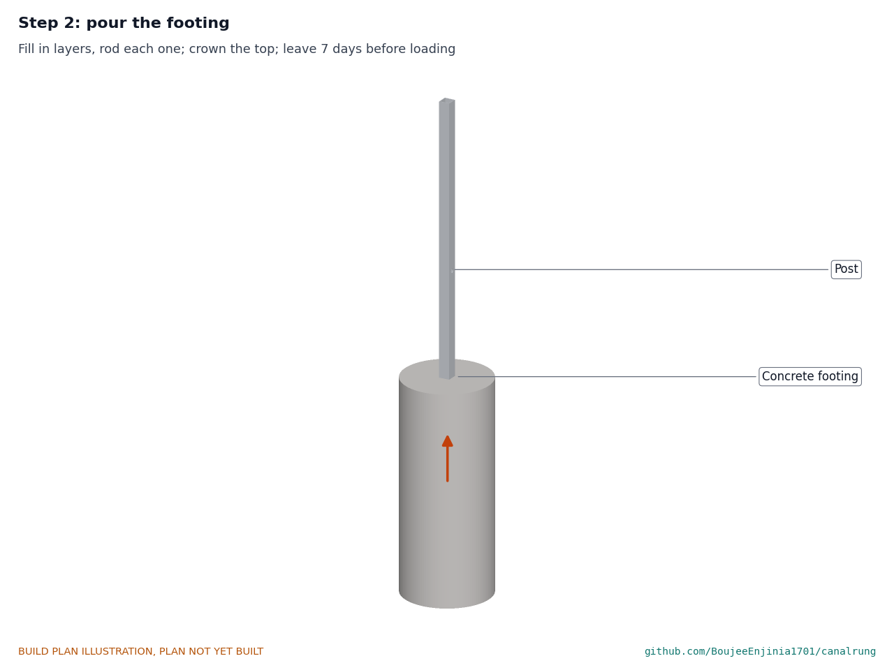

Fill the hole in layers of about 200, rodding each one, up to just above the ground; slope the top away from the post. Check plumb again after each layer. **Hold point:** leave 7 days, kept damp, before anything is fixed to the eye nut.

### Step 3: crush tube into the post

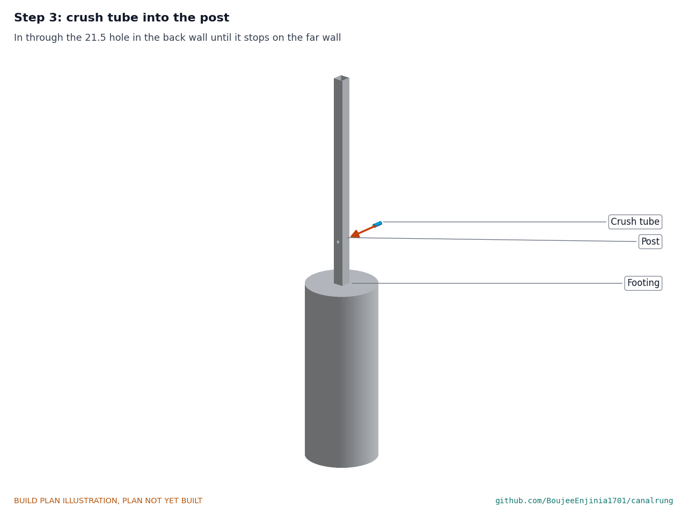

Slide the crush tube into the 21.5 hole in the back wall until it stops on the inside of the canal-side wall. Its end should be flush with the back face.

### Step 4: anchor bolt and eye nut

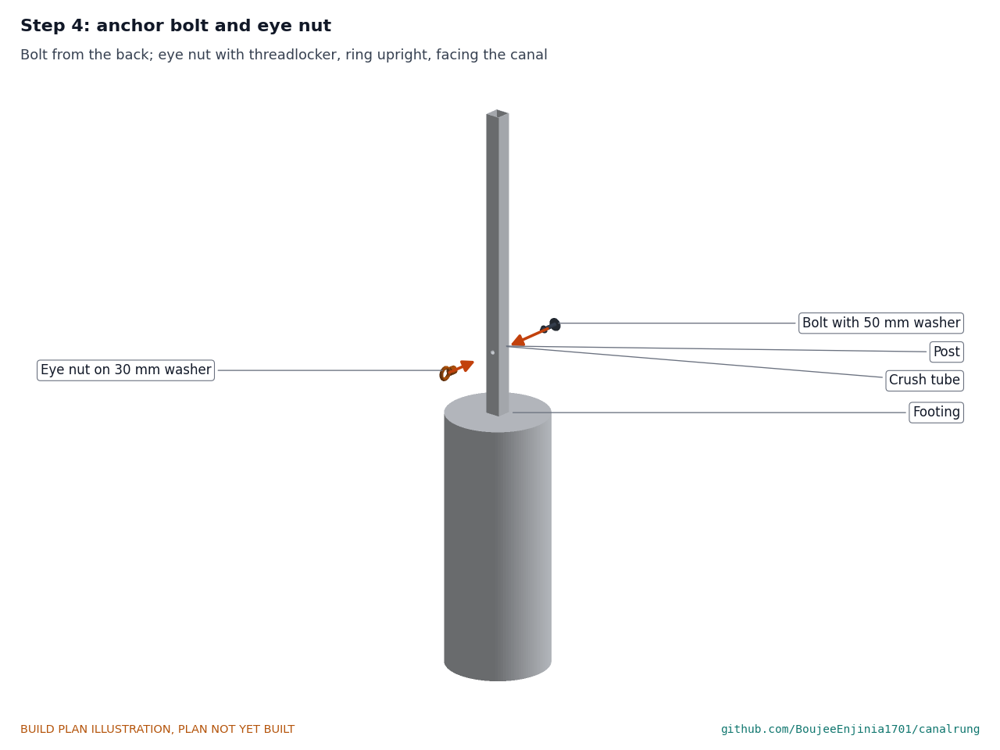

Put the 50 washer on the bolt and push the bolt in from the back, through the crush tube and out of the canal-side hole. Put the 30 washer on the bolt on the canal side. Put two drops of high-strength threadlocker on the thread and screw on the eye nut by hand until it is tight on the washer with its ring upright (in line with the canal-side face, standing vertical). Hold the eye nut and tighten the bolt head with a 24 spanner until firm; the ring must end upright. **Hold point:** leave the threadlocker 24 hours before loading.

### Step 5: mounting plate and U-bolts

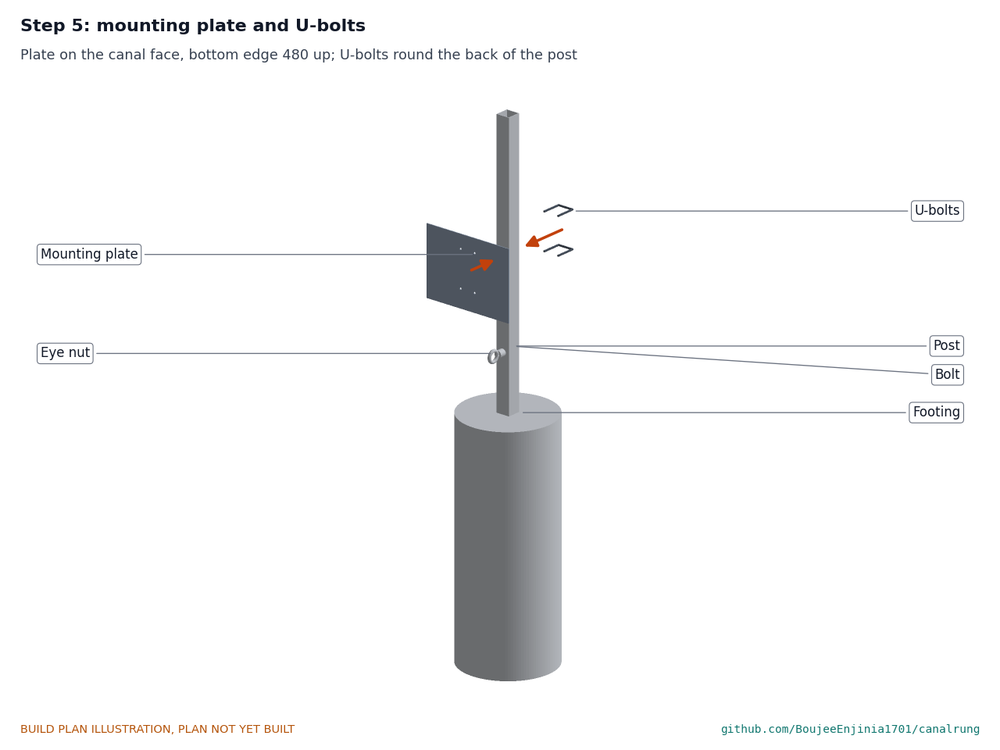

Hold the plate on the canal-side face, centred, its bottom edge 480 above the ground. Pass the two U-bolts round the back of the post and through the plate's holes, the lower one through the lower pair.

### Step 6: box onto the U-bolt legs

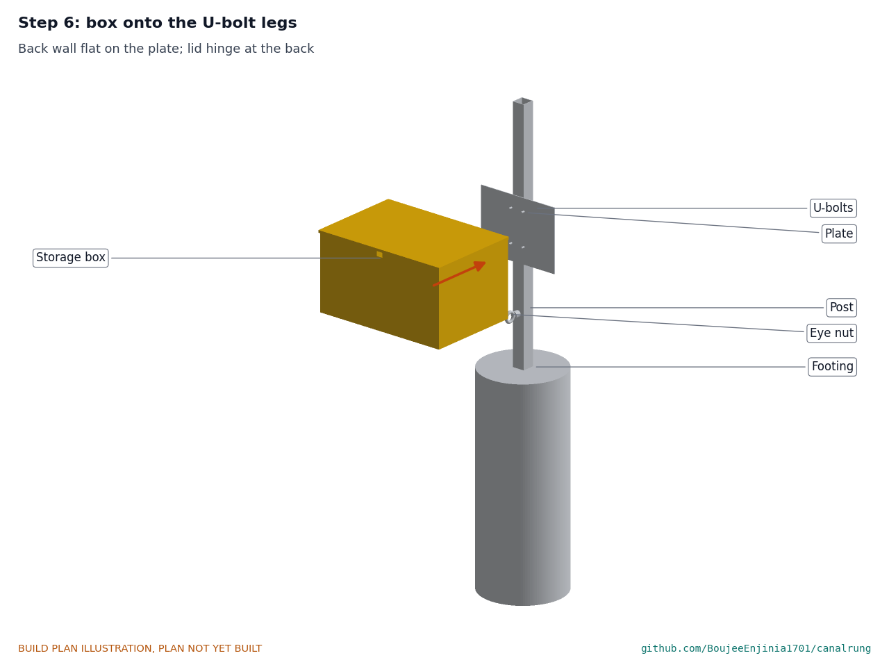

Lift the box onto the four U-bolt legs through the holes in its back wall, lid hinge at the back, until the back wall sits flat on the plate.

### Step 7: box fixings, post cap, decals and knife

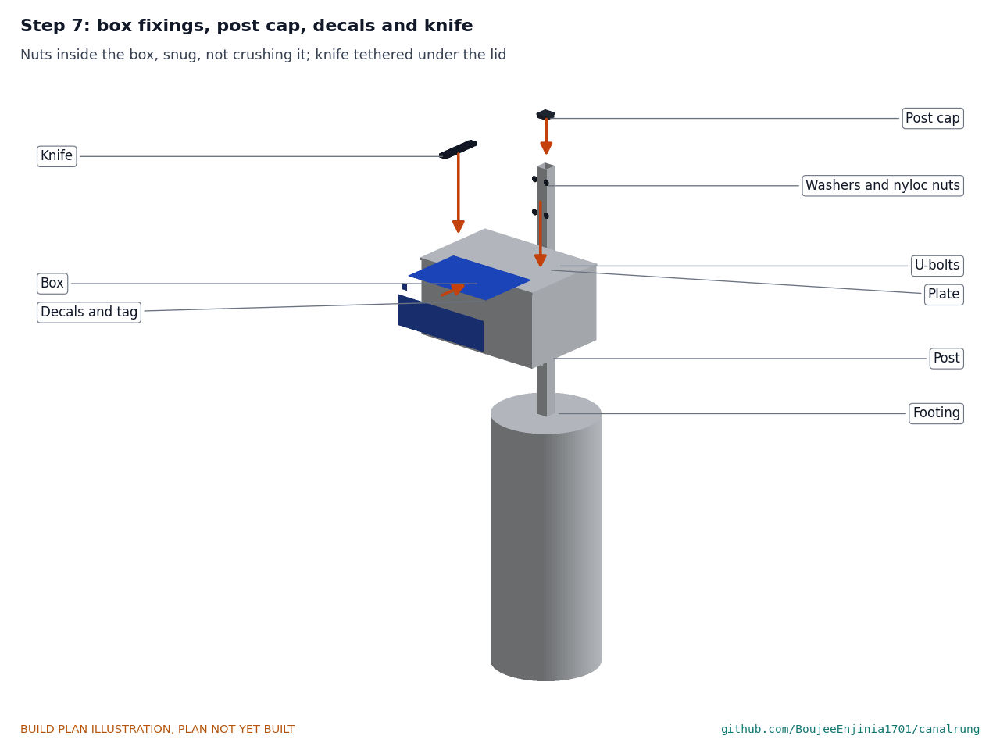

Inside the box, put a fender washer and a nyloc nut on each U-bolt leg and tighten them evenly with a 13 spanner until the box is firm on the plate and the plate on the post; stop before the plastic dishes. Tap the cap onto the post. Apply the decals and fit the tamper tag. Tether the knife under the lid.

### Step 8: float sleeves onto the rungs

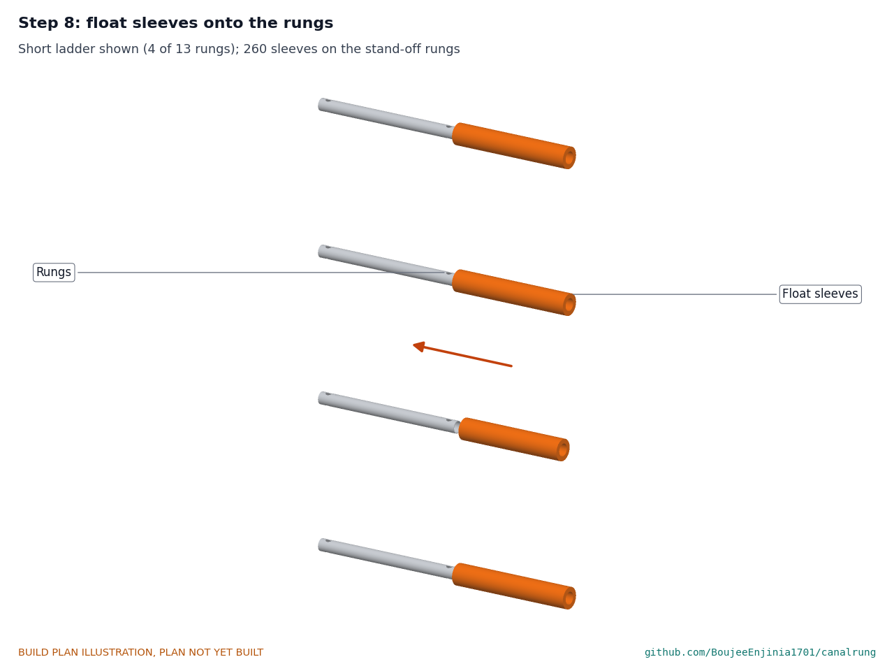

Slide a 294 sleeve onto each plain rung and a 260 sleeve onto each stand-off rung (3, 6, 9 and 12), with a bead of adhesive inside each end, and centre it.

### Step 9: stand-off blocks on rungs 3, 6, 9 and 12

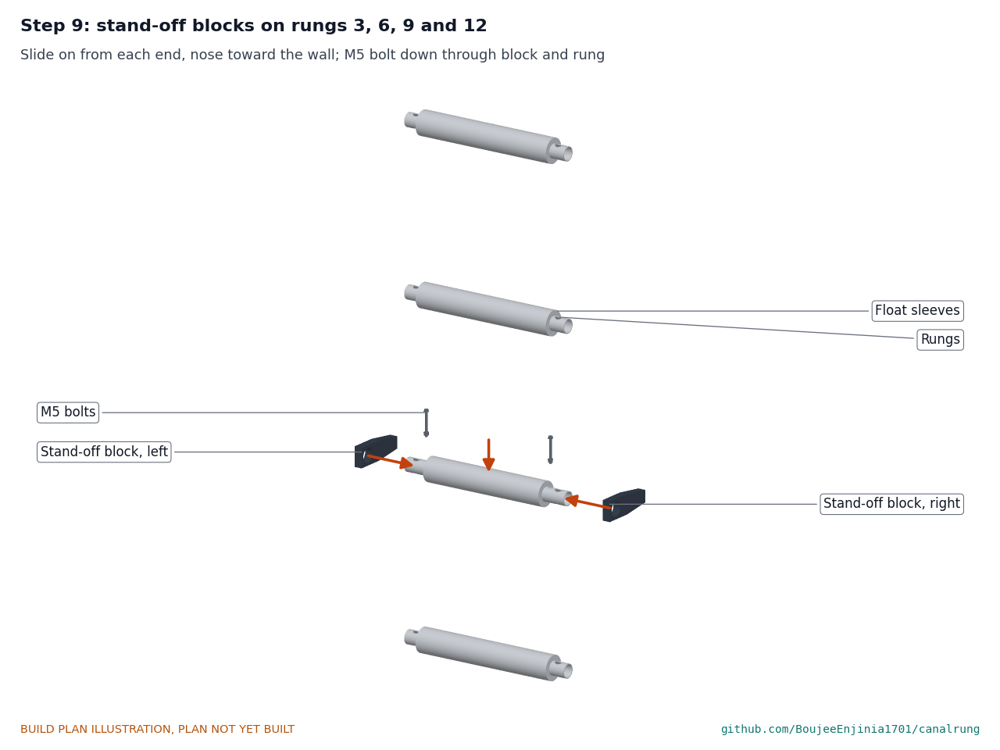

On each stand-off rung, slide a block onto each end, nose toward the same side, up to the sleeve. Line up the block holes with the rung's 5.3 holes and put an M5 bolt down through each with a washer under the head; washer and nyloc nut underneath; tighten until the block does not turn. All the noses point to the wall side.

### Step 10: rope bushes and end caps

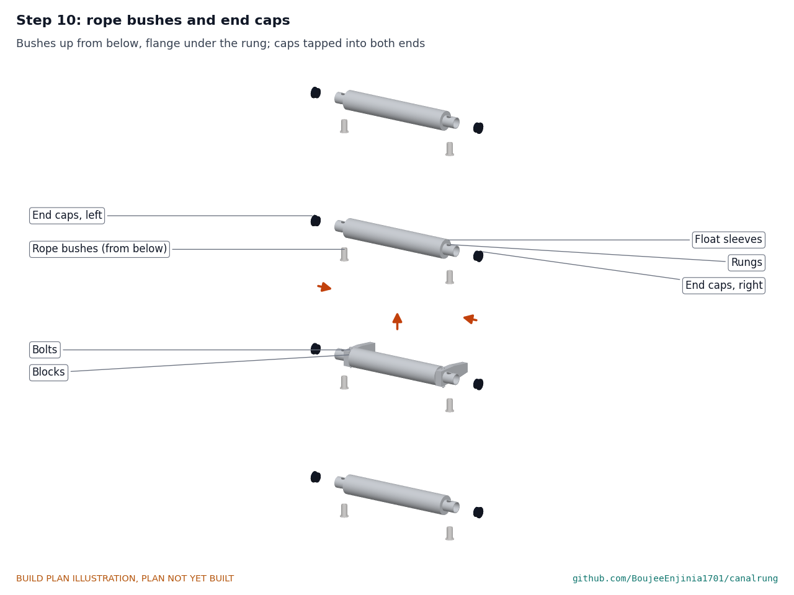

Push a bush up into each rope hole from below until its flange sits on the rung; its top should be just proud of the top of the rung. On stand-off rungs, check the "below" side matches the other rungs: with the noses pointing away from you, the flanges are on the underside. Tap an end cap into each end of every rung.

### Step 11: thread the ropes and tie the knots

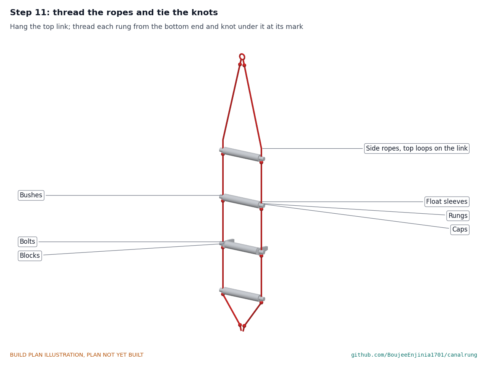

Hang both top loops on the top screw link from a beam or strong hook, or lay the ropes out on a clean floor. Take rung 1. Pass the free end of the left rope up through the bush at the left end of the rung from below, and the right rope through the right end, and slide the rung up to the rung 1 marks. Tie an overhand stopper knot in each rope just under the bush flange so the top of the knot sits on the mark, and pull it tight; the rung must sit level. Repeat for rungs 2 to 13 in order, threading each from the free ends. Keep the stand-off noses all on the same side. Below rung 13, measure 280 and tie a figure-eight on a bight in each rope for the bottom link.

### Step 12: seizings above every rung end

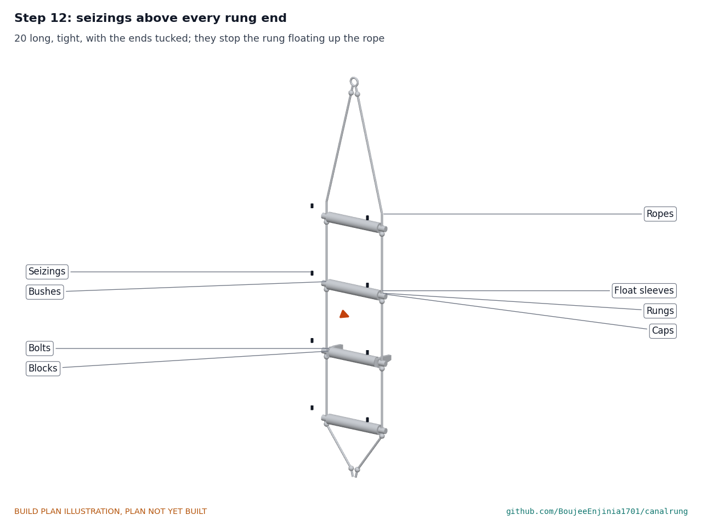

At each rung end, just above the bush, whip the rope tightly with the twine for 20, then tuck and pull the end under the turns. The seizing must not slide when pushed with a thumb. There are 26 seizings.

### Step 13: bottom link and throw weight

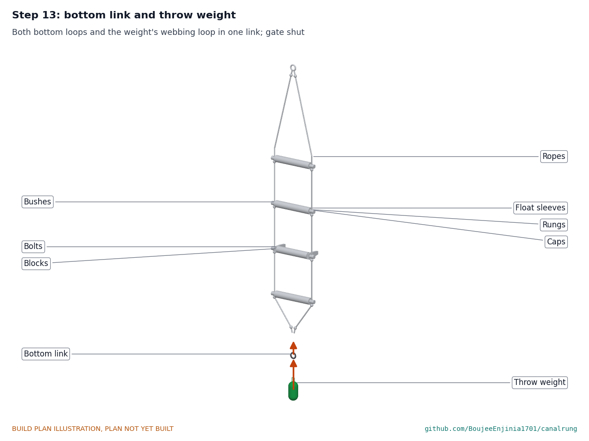

Open the bottom screw link, put both bottom loops and the throw weight's webbing loop in it, and screw the gate fully shut by hand, then a quarter turn with a spanner.

### Step 14: edge protectors on the top lead

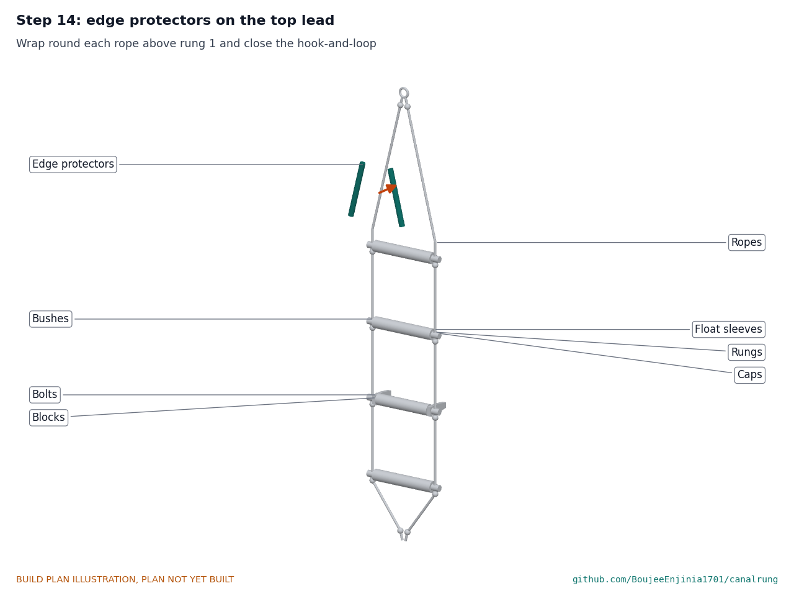

Wrap one sleeve round each rope between rung 1 and the top link, about 200 above rung 1, and close the hook-and-loop. They slide along the rope to wherever it crosses the edge.

### Step 15: top link onto the eye nut

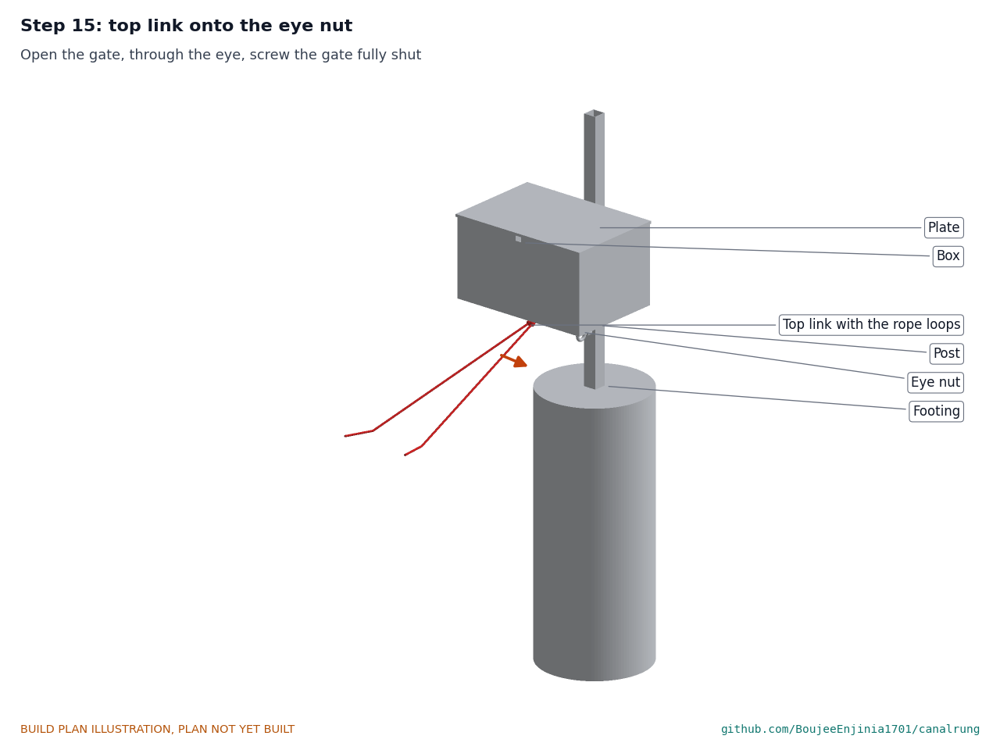

Take the top screw link with both rope loops in it, open its gate, pass it through the eye nut's ring and screw the gate fully shut, then a quarter turn with a spanner. Lead the ropes from the eye nut under the box, up its front and in through the rim notch.

### Step 16: fold the ladder into the box

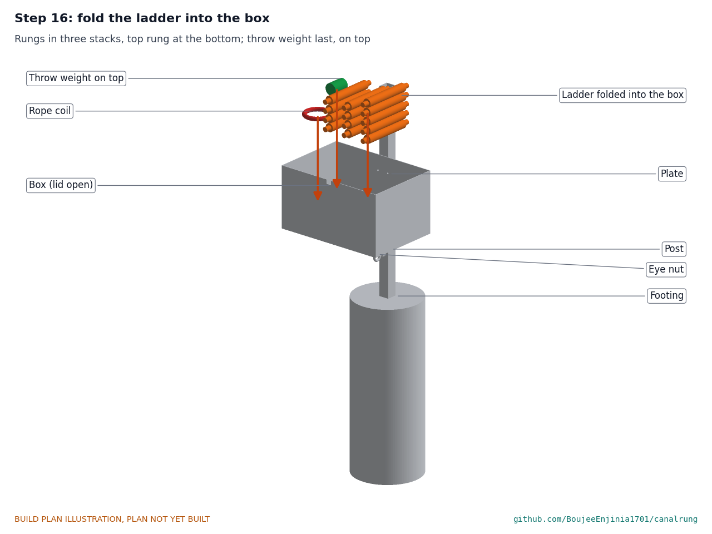

Open the lid. Fold the ladder into the box rung by rung, starting from the top (rung 1 at the bottom of the box) in three stacks across the box, with the ropes lying between the stacks and no rope crossing over a rung. Coil the tail and put the throw weight on top, where a hand finds it first. Close the lid over the ropes in the notch, latch it and fit the tamper tag.

## 5. First checks

The plan lists them; a TRL 4 test report records them. Each is done only when the safety stops in section 6 allow it.

*Table 2. First checks.*

| Check | Requirement | How | Pass when |
| --- | --- | --- | --- |
| Post plumb and firm | R6 | Spirit level on two faces after 7 days; push hard at the top | Plumb within 5 in 1,000; no movement felt |
| Ladder mass | R2 | Weigh everything that leaves the box on a hanging scale | Recorded; the target is 4.5 kg and the estimate 4.27 kg |
| Knots and rungs level | R4, R5 | Hang the ladder by its top link; sight along the rungs | Every rung level within 10 end to end; pitch 335 within 10 |
| Rung proof load | R4 | Ladder hung from a test frame (CalRig); 1.5 kN at the middle of each rung for 1 min, by weights | No visible bend afterward (under 1 at the middle); no knot slip over 10 |
| Ladder system proof load | R4 | 4.5 kN through the top link to the bottom rung, pulled by a calibrated rig | Holds 3 min; no damage to rope, knots, bushes or links |
| Anchor proof load | R6 | 4.5 kN on the eye nut toward the canal, at ground height, after 7 days' cure, with a calibrated rig | Holds 3 min; top of post moves under 10; no cracks at the footing |
| Floats | R3 | Ladder with its weight laid in a test tank | Every rung floats; the weight hangs below the bottom rungs |
| Throw | R2 | Ten untrained adults throw on dry land to a target 3 m away | 8 of 10 land within 1 m |
| Deploy time | R7 | Untrained volunteers, pictogram only, from closed box to ladder at the bottom of a test wall | Under 30 s |
| Climb | R5 | Adult volunteer in a 1.5 deep test tank with a smooth vertical wall, lifeguards present | Out in under 60 s |
| Box | R8 | Hose the closed box for 5 min; open it | Water drains out; the lid closes over the ropes |

## 6. Safety stops

Work stops at each point below until everything listed is true.

> **Safety:** The ladder carries a person's life. No one climbs it, stands on it or tests it in water until the stops below are cleared, and it is never placed at a real canal at TRL 4 without the canal operator's written permission.

1. **Before digging:** buried services located and marked; the hole at least 1,000 from the canal edge; a second person present and a life jacket worn by anyone within 2 m of the edge.
2. **Before loading the eye nut:** the concrete has cured 7 days; the eye nut is forged and marked with its rating; the threadlocker has cured 24 hours; the screw link gate is shut.
3. **Before any proof load:** the rig is calibrated, everyone is out of the line of the rope and behind the post, and the load is raised slowly and held, never dropped.
4. **Before anyone climbs, even on dry land:** the rung, system and anchor proof loads have passed; every knot, seizing, bush and link has been inspected; the climb is no more than 1 m off the ground with a mat below.
5. **Before any water test:** test tank only, never a canal; lifeguards in attendance; still water; volunteers briefed, in life jackets, and free to stop; the knife at hand.
6. **After any load test or use:** inspect the whole ladder before it goes back in the box, and retire any rope that was loaded over an edge without its sleeve.

## 7. Tools, skills and workspace

- **Tools:** tape measure, square, fine marker; hacksaw with a fine blade or tube cutter; files and a deburring tool; drill press with a V-block (or a drill guide), drills 5.3, 6, 9, 16, 17.5 and 21.5, an 8 drill for the box, and a 28.8 step drill or hole saw for the blocks; spanners or sockets 8, 13 and 24; sharp knife and hot knife for rope; spirit level; post-hole auger or spade; bucket, mixing tub and rod for concrete; hanging scale.
- **Skills:** basic metal and plastic work; mixing and placing concrete; rope work: figure-eight on a bight, overhand stopper knot and a tight seizing, all dressed and set. Anyone new to rope work should practise the knots on spare rope first and have them checked.
- **Workspace:** a bench with a drill press; a clean floor 9 m long or a strong beam about 2.5 m up to hang the ladder while threading it; for the station, the agreed site on the canal bank with a second person.

## 8. Where the numbers come from

- Model: `cad/src/model.py` (dimensions, constructability checks, STEP and STL in `cad/step/` and `cad/stl/`).
- Pictures: `cad/src/build_plan_media.py` (this plan's figures and the making sketches).
- Drawings: `cad/drawings/CNR-DWG-001` (general arrangement) and `CNR-DWG-101` to `CNR-DWG-109` (making sketches).
- Calculations: `docs/04-calcs/01-sizing.md` and `docs/04-calcs/sizing.py` (CNR-CAL-001).
- Bill of materials: `bom/bom.csv`.
- Decisions: `docs/decisions/0002-design-for-construction.md` (CNR-DDR-002) and `docs/06-design-decisions.md` (CNR-DEC-001).
